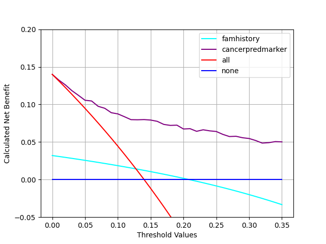

```{css, echo=FALSE}
body {
  font-family: Arial, sans-serif;
  line-height: 1.6;
  color: #333;
}

.center {
  display: flex;
  justify-content: center;
  align-items: center;
  flex-direction: column;
}

.center img {
  max-width: 100%;
  border-radius: 10px;
  box-shadow: 0 4px 6px rgba(0, 0, 0, 0.1);
}

h1 {
  font-size: 2.5em;
  margin-bottom: 10px;
}

p {
  font-size: 1.1em;
  text-align: justify;
  margin-bottom: 20px;
}

a {
  color: #1a73e8;
  text-decoration: none;
}

a:hover {
  text-decoration: underline;
}
```
<div class="center">
  <h1>Decision Curve Analysis</h1>
  
</div>

Decision Curve Analysis is a statistical method that evaluates models in terms of their clinical outcomes on patients. Unlike traditional accuracy measures, such as the area-under-the-curve or Brier score, Decision Curve Analysis takes into account clinical consequences. Decision Curve Analysis compares models to two default strategies: treat all patients & treat no patients. It evaluates the net benefit of a model, which is the benefit minus the harm of a given strategy. Decision Curve Analysis is particularly useful for assessing the clinical utility of diagnostic & prognostic models. In the 'Software Tutorial' tab, we provide step-by-step instructions for code installation & performing Decision Curve Analysis for binary & time-to-event outcomes using R, Stata, SAS, & Python. We also cover multivariable Decision Curve Analysis, evaluation of published models, saving net benefit values, interventions avoided, survival outcomes, competing risks, case-control designs, & incorporating harms.

In the "Peer-Reviewed Literature" tab you can find references to the original papers describing Decision Curve Analysis methodology, theory papers explaining the mathematical derivation of net benefit, introductory guides to Decision Curve Analysis (including separate guides for researchers and readers), and examples of editorials that justify the advantages of decision curve analysis over other methods of model evaluation.

```{r setup, include=FALSE}
  # knitr::opts_chunk$set(echo = TRUE)
  # options(knitr.duplicate.label = "allow")
  # ```
  # 
  # ```{r, render, echo = FALSE, include=FALSE}
  # rmarkdown::render("dca-tutorial.Rmd")
  # 
  # rmarkdown::render("dca-tutorial.Rmd",
  #                  params = list(language = "r"),
  #                  output_file = "dca-tutorial-r.html")
  # rmarkdown::render("dca-tutorial.Rmd",
  #                  params = list(language = "stata"),
  #                  output_file = "dca-tutorial-stata.html")
  # rmarkdown::render("dca-tutorial.Rmd",
  #                  params = list(language = "sas"),
  #                  output_file = "dca-tutorial-sas.html")
  # rmarkdown::render("dca-tutorial.Rmd",
  #                  params = list(language = "python"),
  #                  output_file = "dca-tutorial-python.html")
  # rmarkdown::render("literature.Rmd")
  # rmarkdown::render("resources.Rmd")
```

