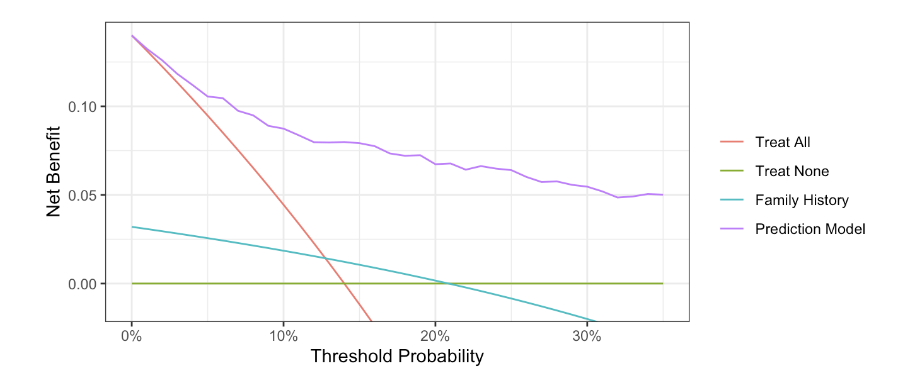

<style>
.title{
  display: none;
}
</style>

```{css, echo=FALSE}
body {
  font-family: Arial, sans-serif;
  line-height: 1.6;
  color: #333;
}

.center {
  display: flex;
  justify-content: center;
  align-items: center;
  flex-direction: column;
}

.center img {
  max-width: 100%;
  border-radius: 10px;
  box-shadow: 0 4px 6px rgba(0, 0, 0, 0.1);
}

h1 {
  font-size: 2.5em;
  margin-bottom: 10px;
}

p {
  font-size: 1.1em;
  text-align: justify;
  margin-bottom: 20px;
}

a {
  color: #1a73e8;
  text-decoration: none;
}

a:hover {
  text-decoration: underline;
}
```

<div class="center">
  <h1>Decision Curve Analysis</h1>
  
</div>

Decision curve analysis is a statistical method that evaluates models and tests in terms of their clinical consequences. This is unlike traditional accuracy measures - such as the area-under-the-curve or Brier score - which do not take into account considerations such as, for instance, it being worse to miss a cancer (false negative) than do an unnecessary biopsy (false positive). Decision curve analysis evaluates the net benefit of a model or test in comparison to the two default strategies of treat all patients and treat no patients.

In the “Software Tutorial” tab, we provide step-by-step instructions for code installation and then actually performing decision curve analysis for binary and time-to-event outcomes. Separate instructions are given for R, Stata, SAS and Python. We also cover multivariable decision curve analysis, evaluation of published models, saving net benefit values, presenting results in terms of interventions avoided, survival outcomes, competing risks, case-control designs and incorporating harms.

In the “Peer-Reviewed Literature” tab, you can find references to the original papers describing decision curve analysis methodology, theory papers explaining the mathematical derivation of net benefit, introductory guides (including separate guides for researchers and readers) and examples of editorials that recommend the use of decision curve analysis. 

If you can't find an answer to a question in one of the other tabs, click on the "Discussions" tab, which will navigate you to the GitHub discussions forum for all Q&A. If you post a question, someone from our team will get back to you.


```{r setup, include=FALSE}
  knitr::opts_chunk$set(echo = TRUE)
  options(knitr.duplicate.label = "allow")
```

```{r, render, echo = FALSE, include=FALSE}
  # rmarkdown::render("dca-tutorial.Rmd")
  # 
  # rmarkdown::render("dca-tutorial.Rmd",
  #                  params = list(language = "r"),
  #                  output_file = "dca-tutorial-r.html")
  # rmarkdown::render("dca-tutorial.Rmd",
  #                  params = list(language = "stata"),
  #                  output_file = "dca-tutorial-stata.html")
  # rmarkdown::render("dca-tutorial.Rmd",
  #                  params = list(language = "sas"),
  #                  output_file = "dca-tutorial-sas.html")
  # rmarkdown::render("dca-tutorial.Rmd",
  #                  params = list(language = "python"),
  #                  output_file = "dca-tutorial-python.html")
  rmarkdown::render("literature.Rmd")
  rmarkdown::render("resources.Rmd")
```

